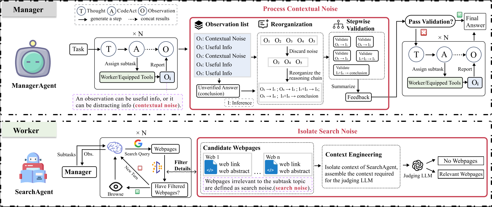
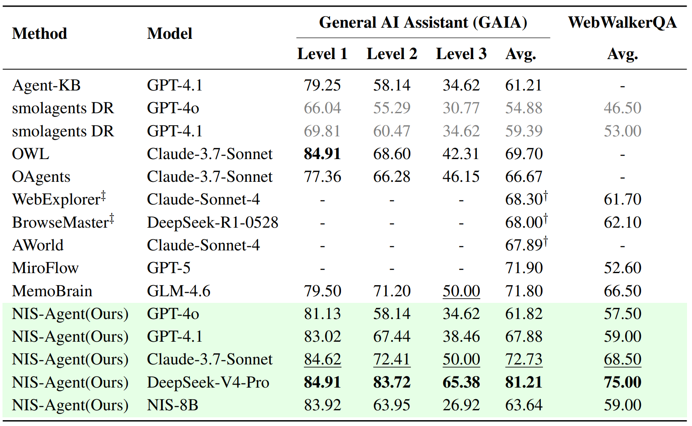

# NIS-Agent [EMNLP 2026]

[](https://arxiv.org/abs/2608.23045) [](https://www.python.org/) [](./LICENSE)
## Framework

## Main Results



## Installation and Setup  

### NIS-Agent Installation

From the repository root, enter the example directory:

```bash
cd examples/open_deep_research
```

Create and activate the Conda environment:
```bash
conda env create -f ../../environment.yml
conda activate nis-agent
```

Install the development version of smolagents:
```bash
pip install -e "../../.[dev]"
```

### Configure the Embedding Model
Download the following models from Hugging Face:
**Embedding model:** `BAAI/bge-large-en`
**tokenizer** `gpt2`

#### Environment Variables  
The agent uses `GoogleSearchTool` for web search. Set the API key for the selected provider:
- **SerpApi:** Set `SERPAPI_API_KEY`. [Sign up here to obtain a key](https://serpapi.com/users/sign_up)
- **Serper:** Set `SERPER_API_KEY`. [Sign up here to obtain a key](https://serper.dev/signup)

The agent uses `SUPADATA` to retrieve YouTube transcripts. If it is not configured, it falls back to [youtube-transcript-api](https://github.com/jdepoix/youtube-transcript-api).
- **Supadata:** Set `SUPADATA_API_KEY`. [Sign up here to obtain a key](https://dash.supadata.ai/auth/sign-up)

Set `YOUTUBE_API_KEY` to enable access to YouTube comments and related information.
- **YouTube Data API v3:** [Create credentials here](https://console.cloud.google.com/apis/credentials)


Depending on the models and services you use, you may also need to configure the following environment variables. See and modify `examples/open_deep_research/env.sh` as needed:

```text
OPENAI_BASE_URL / OPENAI_API_KEY                         # Main model
RETRIEVE_BASE_URL / RETRIEVE_API_KEY / RETRIEVE_MODEL    # Retrieval model
CODER_BASE_URL / CODER_API_KEY / CODER_MODEL              # Coding model
VALIDATION_BASE_URL / VALIDATION_API_KEY / VALIDATION_MODEL  # Validation model
SERPAPI_API_KEY or SERPER_API_KEY                         # Search service
SUPADATA_API_KEY                                           # YouTube transcript service (optional)
YOUTUBE_API_KEY                                            # YouTube Data API (optional)
```

### Initialize the API Databases (Optional)

The agent system includes several API databases for retrieving and calling external APIs. If you want to use API retrieval, initialize the databases before the first run:

```bash
cd examples/open_deep_research
python scripts/init_databse.py
```

The script generates structured databases for the following APIs:
- **MediaWiki Action API** - Wikipedia content queries (no authentication required)
- **YouTube Data API v3** - YouTube videos, comments, and channel information (API key required)
- **ORCID Public API** - Researcher information queries (a token is required for some operations)

**Command-line options:**
```bash
python scripts/init_databse.py --all        # Build all databases (default)
python scripts/init_databse.py --mediawiki  # Build only the MediaWiki database
python scripts/init_databse.py --youtube    # Build only the YouTube database
python scripts/init_databse.py --orcid      # Build only the ORCID database
python scripts/init_databse.py --clean      # Clean and rebuild
python scripts/init_databse.py --quiet      # Quiet mode
```

Generated files are stored in `scripts/init_api_database/`:
- `*_api.json` - Structured JSON database
- `*_api_llm.md` - LLM-friendly Markdown documentation
- `*_api_summary.md` - Quick endpoint reference

### Usage  
After completing the installation and configuration, run `run.py` from the `examples/open_deep_research` directory:
```bash
python run.py --model-id "gpt-4.1" "your question here!"
```
### GAIA

#### Prepare the GAIA Dataset
Download the GAIA dataset files to `examples/open_deep_research/data/gaia/2023/`. Dataset: <https://huggingface.co/datasets/gaia-benchmark/GAIA/tree/main/2023>


#### Run the GAIA Dataset 
The script runs all unfinished tasks in the `validation` split by default. To limit the number of tasks, change the following line in `examples/open_deep_research/run_gaia.py`:
```py
tasks_to_run = get_examples_to_answer(answers_file, eval_ds)[:20]
```

Example command:
```bash
python run_gaia.py --concurrency <num> --run-name <run-name> --model-id <model-id>
```
For example:
```bash
python run_gaia.py --concurrency 1 --run-name large_scale_gpt-4o --model-id gpt-4o
```

**Evaluate accuracy**
Pass one or more JSONL result files to `gaia_evaluator.py` through the command line:
```
python gaia_evaluator.py outputs/gaia_outputs/validation/<run-name>.jsonl
```

**Calculate token usage**
`calculate_tokens.py` reads the execution log and calculates token usage. When running GAIA, you can save the terminal output to a log file:
```
python calculate_tokens.py <log-file>
```
For example:
```bash
python run_gaia.py --concurrency 1 --run-name <run-name> --model-id <model-id> | tee -a <run-name>.log
python calculate_tokens.py <run-name>.log
```

### Webwalker

#### Run the WebWalkerQA Dataset
- No manual download is required; the script loads `callanwu/WebWalkerQA` through `datasets`.
- Run the command from `examples/open_deep_research`:
```bash
python run_webwalker.py --concurrency 1 --run-name webwalker-o1-try --model-id o1 --max-questions 50
```

Arguments:
- `--concurrency`: Number of concurrent workers
- `--run-name`: Run name; output is saved to `outputs/webwalker_outputs/raw_output/<run-name>.jsonl`
- `--model-id`: Model, such as `o1`, `gpt-4o`, or `gemini-2.5-pro`
- `--enable-task-decomposition`: Optional; enable initial task decomposition
- `--max-questions`: Optional; limit the number of questions in the run

Example output path:
- Predictions: `outputs/webwalker_outputs/raw_output/webwalker_task.jsonl`

#### Evaluate WebWalkerQA Accuracy

Use `webwalker_llm_evaluator.py` to evaluate the predictions with a language model. Pass the input file as a positional argument; evaluation results are automatically written to a subdirectory next to the input file:
```bash
python webwalker_llm_evaluator.py \
  outputs/webwalker_outputs/raw_output/webwalker_task.jsonl \
  --model gpt-4o
```

## Acknowledgement

This work builds upon [smolagents](https://github.com/huggingface/smolagents).  
smolagents is an excellent open-source library that enables running powerful agents with just a few lines of code.  
Many thanks to the developers of smolagents for creating such a solid foundation.

## Cite Us

```bibtex
@misc{zhang2026inertiaobjectivityimprovingdeep,
  title={From Inertia to Objectivity: Improving Deep Research Agents with Noise Isolation},
  author={Xiangxin Zhang and Zhanwei Zhang and Zhihang Fu and Binbin Lin and Wenxiao Wang},
  year={2026},
  eprint={2608.23045},
  archivePrefix={arXiv},
  primaryClass={cs.AI},
  url={https://arxiv.org/abs/2608.23045},
}
```
